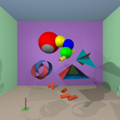
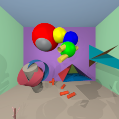
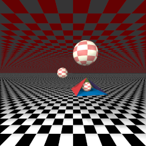
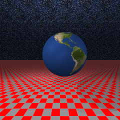

### Hi, I'm Fqest

## I am a student at School 21 (Ecole 42)

  

<table>
    <thead>
        <tr>
          <td style="text-align:center;">Libft</td> <td>  </td>
        </tr>     
        <tr>
          <td style="text-align:center;">Netwhat</td> <td>  </td>
        </tr>  
        <tr>
          <td style="text-align:center;">Get_next_line</td> <td>  </td>
        </tr>       
        <tr>
          <td style="text-align:center;">Ft_printf</td> <td>  </td>
        </tr>     
        <tr>
          <td style="text-align:center;">Ft_server</td> <td>  </td>
        </tr>        
        <tr>
          <td style="text-align:center;">Libasm</td> <td>  </td>
        </tr>         
        <tr>
          <td style="text-align:center;">MiniRT</td> <td>  </td>
        </tr>
        <tr>
          <td style="text-align:center;">Minishell</td> <td>  </td>
        </tr>
        <tr>
          <td style="text-align:center;">Push_swap</td> <td>  </td>
        </tr>        
        <tr>
          <td style="text-align:center;">Philosophers</td> <td>  </td>
        </tr>        
        <tr>
          <td style="text-align:center;">CPP Modules</td> <td>  </td>
        </tr>      
    </thead>
    <tbody>
    </tbody>
</table>

#### MiniRT:

  
  
  
  
  

