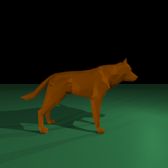

### Hi, I'm Fqest

## I am a student at School 21 (Ecole 42)

  

<table>
    <thead>
        <tr>
          <td style="text-align:center;">Libft (С)</td> <td>  </td>
        </tr>     
        <tr>
          <td style="text-align:center;">Netwhat (network)</td> <td>  </td>
        </tr>  
        <tr>
          <td style="text-align:center;">Get_next_line (С)</td> <td>  </td>
        </tr>       
        <tr>
          <td style="text-align:center;">Ft_printf (С)</td> <td>  </td>
        </tr>     
        <tr>
          <td style="text-align:center;">Ft_server (Docker)</td> <td>  </td>
        </tr>        
        <tr>
          <td style="text-align:center;">Libasm (ASM)</td> <td>  </td>
        </tr>         
        <tr>
          <td style="text-align:center;">MiniRT (С)</td> <td>  </td>
        </tr>
        <tr>
          <td style="text-align:center;">Minishell (С)</td> <td>  </td>
        </tr>
        <tr>
          <td style="text-align:center;">Push_swap (С)</td> <td>  </td>
        </tr>        
        <tr>
          <td style="text-align:center;">Philosophers (С)</td> <td>  </td>
        </tr>        
        <tr>
          <td style="text-align:center;">CPP Modules (С++)</td> <td>  </td>
        </tr>    
        <tr>
          <td style="text-align:center;">Inception (Docker compose)</td> <td>  </td>
        </tr>    
        <tr>
          <td style="text-align:center;">Ft_containers (С++)</td> <td>  </td>
        </tr>    
        <tr>
          <td style="text-align:center;">Webserver (С++)</td> <td>  </td>
        </tr>   
    </thead>
    <tbody>
    </tbody>
</table>

#### MiniRT:

  
  
  
  
  

